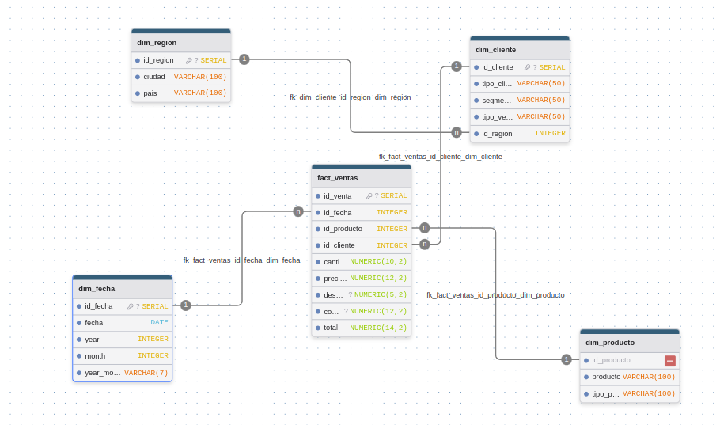

# Modelo de Base de Datos (ER)

## Esquema Estrella
**Tablas Dimensión**
- `dim_fecha` (fecha, year, month, year_month)
- `dim_producto` (producto, tipo_producto)
- `dim_region` (ciudad, pais)
- `dim_cliente` (tipo_cliente, segmento_cliente, tipo_venta, id_region)

**Tabla Hechos**
- `fact_ventas` (id_fecha, id_producto, id_cliente, cantidad, precio_unitario, descuento, costo_envio, total)

## Relaciones
- `fact_ventas.id_fecha` → `dim_fecha.id_fecha`
- `fact_ventas.id_producto` → `dim_producto.id_producto`
- `fact_ventas.id_cliente` → `dim_cliente.id_cliente`
- `dim_cliente.id_region` → `dim_region.id_region`

> Este diagrama puede elaborarse en Draw.io o similares.
