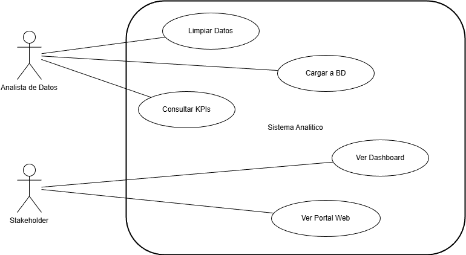
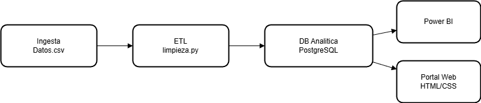
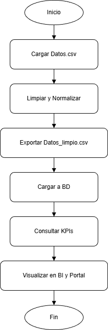

# Diagramas UML (Guía de Entrega)

## 1. Diagrama de Casos de Uso
**Actores:** Analista de datos, Stakeholder  
**Casos de uso:** Limpiar datos, Cargar a BD, Consultar KPIs, Ver dashboard, Ver portal.

## 2. Diagrama de Componentes
Componentes sugeridos:
- Limpieza (Python)
- Base de datos (PostgreSQL)
- BI (Power BI)
- Portal Web (HTML/CSS)

## 3. Diagrama de Actividad
Flujo sugerido:
1. Cargar datos crudos  
2. Limpiar y validar  
3. Exportar `Datos_limpio.csv`  
4. Cargar a BD  
5. Consultar KPIs  
6. Visualizar y publicar en portal

> Nota: Estos diagramas se pueden elaborar en Draw.io o Lucidchart.
